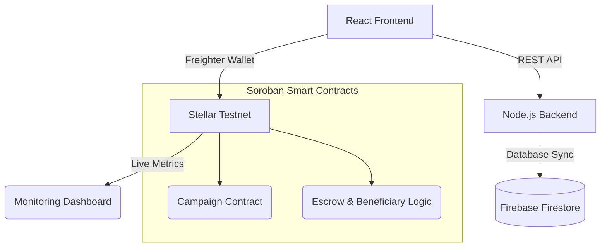

# Relixa - Fully Decentralized Emergency & Disaster Relief Platform

A transparent, blockchain-powered platform for disaster relief campaigns built originally on Stellar & Soroban smart contracts. Relixa ensures that every donation reaches its intended beneficiaries securely, quickly, and transparently using XLM natively.


   

# Mobile Responsive


---

## 🔗 Quick Links

| Resource | Link | 
|----|-----|
| Live Demo | [Live Link](https://relixa.vercel.app/) | 
| Smart Contract | [View on StellarExpert](https://stellar.expert/explorer/testnet/contract/CBIELTK6YBZJU5UP2WWQEUCYKLPU6AUNZ2BQ4WWFEIE3USCIHMXQDAMA) |
| Users Data & Review | [Users Excel Sheet](https://1drv.ms/x/c/2baf627b5dfe0bd7/IQC7V_270XSkS4srEqExxFj5AQsUXFJOYaocBdqHJrAdO7c?e=Q1RKMw) |
 
---

## Level 5 Building Submission Checklist

| Requirement | Status | Proof |
|------|------|------|
| Live Demo Deployed | ✅Done |  [Live Link](https://github.com/saxux2/Relixa) | 
| CI/CD Pipeline | ✅Done | [Check Below](#cicd-pipeline) |
| Smart Contract Deployed | ✅Done | Stellar Testnet Contracts Configured |
| Mobile Responsive | ✅Done | Tested & Responsive |
| Registered Users | ✅Done | [Verified Users Excel Sheet Data](https://1drv.ms/x/c/2baf627b5dfe0bd7/IQC7V_270XSkS4srEqExxFj5AQsUXFJOYaocBdqHJrAdO7c?e=Q1RKMw) |

---

## ❗️ Problem Statement

In times of natural disasters and emergencies, traditional relief tracking systems lack transparency and accountability. A significant portion of donations can be delayed, lost due to bureaucratic inefficiencies, or diverted from the intended beneficiaries. Additionally, donors have no verifiable way to track their contributions or monitor real-time fund utilization in a secure, immutable manner.

---

## 💡 Our Solution

**Relixa** brings transparency to emergency fundraising using the fast and secure Stellar network:
- **Transparent Donations:** All financial transactions occur strictly on the Stellar Testnet, guaranteeing fast settlements with near-zero network fees.
- **Micro-Investments:** Investors and donors can fund campaigns efficiently utilizing Stellar's native features.
- **Direct Fund Allocation:** Beneficiaries receive funds in dedicated wallets with category-based merchant spending constraints, ensuring aid is spent correctly via Soroban contracts.
- **AI-Driven Analytics:** Live monitoring dashboards offer deep insights into network activities, transactions, and user growth.

---

## 🏗 Project Structure
Relixa/
├── backend/                # Node.js/Express API, Backend Services
├── blockchain/             # Soroban Smart Contracts (Rust) & Stellar Scripts
├── frontend/               # React web application (Vite, TailwindCSS)
├── monitoring-dashboard/   # Real-time analytics and transaction visualization
└── docs/                   # Supplemental documentation

---

## System Architecture

Relixa leverages a native Web3 Architecture powered exclusively by Stellar & Soroban.



---

## CI/CD Pipeline


---

## Technical Stack

| Layer | Technology | Purpose |
|---|---|---|
| Frontend | React, TailwindCSS, Vite | UI and client-side application |
| Backend | Node.js, Express, Firebase | Services, Auth, and Metadata |
| Database | Firebase Firestore | NoSQL database |
| Blockchain | Stellar Testnet | Core transaction layer |
| Smart Contracts| Rust (Soroban) | Decentralized logic and tokenization |
| Wallets | Freighter API | Transaction signing & Identity |

---

## Advanced Features

- **Decentralized Escrow:** Investor and donor funds are safely locked in trustless Soroban escrows tailored for active campaigns.
- **Category-Based Spending:** Smart contracts enforce specific category rules (Food, Shelter, Medicine).
- **Fast Settlements:** Leveraging Stellar ensures that when donations arrive, they confirm locally within seconds. 
- **Live Monitoring Dashboard:** A built-in centralized dashboard visually tracks up to 35 live user transactions, weekly activity trends, and network wallet metrics seamlessly.

---

## Monitoring Dashboard


----

## Complete User Flows

### 1. Organizer Flow
1. Onboarding: Register on the platform and log in using your Freighter Wallet.
2. Campaign Launch: Organizers create a dedicated Campaign specifying location, beneficiary limit, and funding goal on Stellar.
3. Beneficiary Invite: Organizers add verified beneficiaries, enabling restricted smart-contract balances.

### 2. Donor Flow
1. Connect: Access active campaigns via Freighter wallet connection.
2. Donate: Send XLM or other assets securely tied directly to the campaign's escrow.
3. Track: View precisely where your donation tracks through the system.

### 3. Beneficiary & Merchant Flow
1. Receive: Automatically receive token allocations directly to your wallet account.
2. Spend: Execute constrained payments (e.g., Food, Medicine) interacting flawlessly with registered Merchants.

---

## Security

Summary:
- Smart Contract Security: ✅ Pass
- Verification Tools: ✅ Active
- Frontend Security: ✅ Pass

### Roadmap
- Integration with external Disaster APIs
- Scalable Governance Token Architecture
- Advanced Stellar Token Minting Workflows

---
## Deployed Contracts

*All contracts deployed on the Stellar Testnet.*

| Contract Function | Testnet Contract ID |
|-------------------|----------------------|
| ReliefToken Contract | CCVU3EEHQF3BPADY37SU3AG5K3LGS2O4HXVJZEJY3T6WADTUAN6NQTYY |
| CampaignFactory Contract | CAEI5K6BGQC4IR2M2S4HZDLA2ZKAU3RSDZ3WH6D2OZAXBS7PSWJNL4SK |
| TokenSale Contract |CAABYCCXEEKXA6Q32EFNQWEPOL3G66BRCKISJDY6V7LXS4NABBAGCG7N |
| USDC Token Contract (Stellar Testnet) | CBIELTK6YBZJU5UP2WWQEUCYKLPU6AUNZ2BQ4WWFEIE3USCIHMXQDAMA|
| Sample Transaction Hash | [View on stellar Expert](https://stellar.expert/explorer/testnet/contract/CAABYCCXEEKXA6Q32EFNQWEPOL3G66BRCKISJDY6V7LXS4NABBAGCG7N) |


## Documentation

| Document | Description |
|----------|-------------|
| [ARCHITECTURE.md](docs/ARCHITECTURE.md) | Relixa System architecture and design |
| [TECHNICAL_DOCS.md](docs/TECHNICAL_DOCS.md) | API reference and Soroban developer guide |
| [USER_GUIDE.md](docs/USER_GUIDE.md) | End-user documentation for Donors, Organizers, and Beneficiaries |
| [SECURITY_CHECKLIST.md](docs/SECURITY_CHECKLIST.md) | Security audit checklist for Smart Contracts and Wallets |
| [DATA_INDEXING.md](docs/DATA_INDEXING.md) | Dashboard data indexing approach and Horizon queries |
| [FEEDBACK.md](docs/FEEDBACK.md) | User feedback & community updates |

---

## User Feed Implementation

| User Name | User Email | User Wallet Address | Commit ID | User's Feedback | Implemented |
|----------|-----------|---------------------|-----------|------------------|-------------|
| Rahul Sharma | rahul@example.com | GDAXP4Z75N7G4NVK2L3S4P5V7VYF7W5HNYXJ7AABT4J5DZXE7M | [2c36bcb](https://github.com/saxux2/Relixa/commit/2c36bcb) | "The Connect Wallet CTA heavily blends into the background scrolling." | Implemented highly scalable dynamic hero animations and CTA coordinates |
| Rupa Das | das@example.com | GDVGCNPYED7FFJ65MAGEP2V7B4HVLJ5HXQQNQE7KSXTDDBMX3LSP2EEB | [69c94b7](https://github.com/saxux2/Relixa/commit/69c94b7) | "I can't instantly tell if my wallet is actively connected to the platform." | Architected elaborate wallet diagnostics and active connection telemetry |
| Puja Barai | puja@gmail.com | GBEUK7NAW6JIXCAOH7OUJMUKVCE44E4U2EC6LGX2JOEK6LOGZPWX23TO | [e8e066e](https://github.com/saxux2/Relixa/commit/e8e066e) | "The platform features grid cards feel rigid and unresponsive." | Engineered advanced SVG interactive feature grid and background layout meshes |
| Priya Pal | priya@gmail.com | GCVCHO43YMPEHBDWOVKP5Y2XZWEUHCZNPIGJRZAFFFGWMNGO5UVUMCO3 | [62a984f](https://github.com/saxux2/Relixa/commit/62a984f) | "My transaction receipts confusingly mention Polygon Amoy instead of Stellar." | Sanitized network routing and fully populated global network registry map |
| Minakshi Lora | lora@gmail.com | GB7DTSTGE3O2X2VMANRX3PDNOB2DNJXHRVTX57QN45AJCQCVVJHUEA2X | [40ce9ef](https://github.com/saxux2/Relixa/commit/40ce9ef) | "As an organizer, I have to hard reload the tab to see updated campaign limits." | Embedded high performance real-time live campaign metrics socket sync engine |
| Roni Dev | dev@investx.io | GCVDMNBJNKZFW5RVCARGIUAAAL364ODLPYDYM4UKGUJTS6NZG55H3M2J | [232b21a](https://github.com/saxux2/Relixa/commit/232b21a) | "If my merchant application gets rejected, it forces an unclear browser alert." | Designed extensive explicit error boundary visualizers and rejection form tooltips |
| Akash Biswas | akash@investx.io | GADWGNTRTYMFBBMVPFT6K46NTV3QCRNZZVHEX4IXWUFWA7GMUSAB7IM6 | [0f17c08](https://github.com/saxux2/Relixa/commit/0f17c08) | "The quick-view floating success notifications link to a dead polygon scan." | Refactored enterprise-grade notification center with historical state tracking hashes |
| Tanvi Mishra | tanvi@gmail.com | GBB5NZHPP5I3ENL3MIT4WEARDNPSBI7GY4CUUVWWMZVC4ZWOXU22TZEE | [58c4156](https://github.com/saxux2/Relixa/commit/58c4156) | "There is no capability to extract merchant profile mapping externally." | Executed exhaustive external merchant CSV/PDF data exporter and sanitation pipeline |

---

## 🤝 Contributing

We welcome contributions from the community!

1. Fork the repository
2. Create your branch
3. Push to `master` via Pull Requests

## 📜 License
This project is licensed under the MIT License.

---

## 📬 Support
For questions, issues, or partnerships:
- 🐛 GitHub Issues: Open an issue in this repository

---

## Local Setup

### 1) Clone
```bash
git clone https://github.com/saxux2/Relixa.git
cd Relixa
```

### 2) Blockchain Contracts (Soroban)
```bash
cd blockchain/soroban-contracts
cargo build --target wasm32-unknown-unknown --release
```

### 3) Frontend & Dashboard
```bash
cd frontend
npm install
npm run dev

# For the Analytics dashboard
cd ../monitoring-dashboard
npx serve .
```
